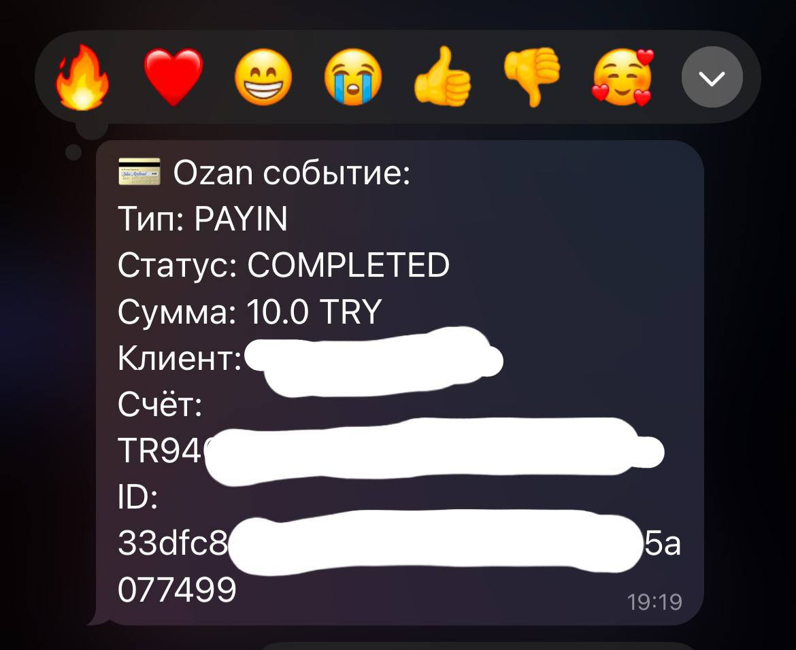

# 🚀 Telegram Webhook для Ozan SuperApp

Этот проект позволяет подключить Telegram-бота к Ozan SuperApp через Webhook, используя `ngrok` для проброса локального порта в интернет.

---



---

## 📦 Установка

### ✅ 1. Установите Python и библиотеки

Убедитесь, что установлен **Python 3.10+**  
Проверьте версию командой:

```bash
python --version
```

Установите зависимости (если есть `requirements.txt`):

```bash
pip install -r requirements.txt
```

---

## ▶️ Запуск сервера

В терминале, находясь в папке со скриптом, выполните:

```bash
python ozan_webhook_telegram.py
```

Вы должны увидеть:

```
* Running on http://127.0.0.1:5000
```

---

## 🌐 Настройка ngrok

### ✅ Шаг 1: Установите ngrok

1. Перейдите на сайт: [https://ngrok.com/download](https://ngrok.com/download)  
2. Скачайте версию для Windows  
3. Распакуйте архив, например, в `C:\ngrok\ngrok.exe`  
4. Добавьте путь к `ngrok.exe` в `PATH` или используйте абсолютный путь

---

### ✅ Шаг 2: Зарегистрируйтесь и получите токен

1. Создайте аккаунт на [ngrok.com](https://ngrok.com)
2. Перейдите в раздел **Auth Tokens**
3. Скопируйте команду авторизации вида:

```bash
ngrok config add-authtoken ТВОЙ_ТОКЕН
```

4. Выполните её в PowerShell или CMD

---

### ✅ Шаг 3: Убедитесь, что Python-сервер работает

Убедитесь, что скрипт `ozan_webhook_telegram.py` запущен и слушает `http://127.0.0.1:5000`

---

### ✅ Шаг 4: Проброс порта через ngrok

Откройте новое окно PowerShell или CMD и выполните:

```bash
ngrok http 5000
```

Вы увидите строку вроде:

```
Forwarding  https://abc12345.ngrok.io -> http://localhost:5000
```

---

### ✅ Шаг 5: Укажите Webhook в Ozan

Используйте ссылку от `ngrok`, добавив к ней `/webhook/ozan`, например:

```
https://abc12345.ngrok.io/webhook/ozan
```

Добавьте её в настройках Webhook в Ozan SuperApp.

---

## 🔄 Автоматизация запуска (опционально)

Создайте файл `run_ngrok.bat` для удобства:

```bat
@echo off
start "" "C:\ngrok\ngrok.exe" http 5000
```

---

## 📬 Обратная связь

Если возникли вопросы — создавайте issue или предлагайте улучшения через pull request.
